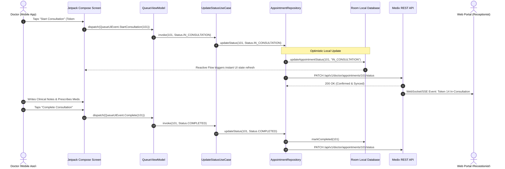
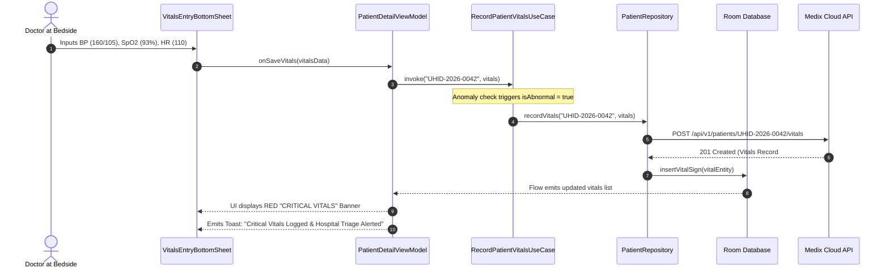

# Medix Doctor Android: Architecture Specification

**Architecture Standard:** Clean Architecture + MVVM + Unidirectional Data Flow (UDF)  
**Target Module:** `android-doctor` (`com.medix.doctor`)  
**Design Patterns:** Repository Pattern, Use Case / Interactor Pattern, NetworkBoundResource, Observer (StateFlow)  

---

## 1. Architectural Philosophy

The **Medix Doctor Android Application** is designed according to enterprise clean architecture principles, separating concerns into distinct, testable, and maintainable layers.

```
       ┌─────────────────────────────────────────────────────────────┐
       │                 UI / Presentation Layer                     │
       │    Jetpack Compose UI  ◄──────►  MVI / StateFlow ViewModels │
       └──────────────────────────────┬──────────────────────────────┘
                                      │ depends on
       ┌──────────────────────────────▼──────────────────────────────┐
       │                      Domain Layer                           │
       │    Use Cases (Interactors)  •  Domain Models  •  Interfaces │
       └──────────────────────────────▲──────────────────────────────┘
                                      │ implemented by
       ┌──────────────────────────────┴──────────────────────────────┐
       │                       Data Layer                            │
       │  Repositories • Room Local DB • Retrofit REST • DataStore   │
       └─────────────────────────────────────────────────────────────┘
```

### Key Principles
1. **Separation of Concerns:** The UI layer knows nothing about HTTP protocols or SQLite schemas. Domain models are pure Kotlin data classes.
2. **Dependency Inversion:** Domain layer defines the interfaces (contracts); the Data layer provides the concrete implementations.
3. **Single Source of Truth (SSOT):** The local Room database acts as the single source of truth for patient records and appointments. The UI observes database updates via Kotlin `Flow`.
4. **Unidirectional Data Flow (UDF):** User actions emit events (`UiEvent`) to the ViewModel, which executes Use Cases and emits immutable UI state (`StateFlow<UiState>`).

---

## 2. Layer-by-Layer Architecture

### 2.1 Presentation Layer (UI)
- **Framework:** 100% Jetpack Compose (Declarative UI) with Material 3 styling.
- **State Management:** `StateFlow<UiState>` exposed from `@HiltViewModel` classes.
- **Side Effects Handling:** `SharedFlow<UiSideEffect>` for one-shot UI events (Snackbars, Navigation, Toast messages).
- **Lifecycle Awareness:** `collectAsStateWithLifecycle()` ensures zero wasted CPU cycles when the activity or composable is backgrounded.

#### Typical ViewModel State Pattern:
```kotlin
// Immutable UI State
data class AppointmentQueueUiState(
    val isLoading: Boolean = false,
    val appointments: List<Appointment> = emptyList(),
    val activeConsultation: Appointment? = null,
    val selectedFilter: AppointmentStatus? = null,
    val errorMessage: String? = null
)

// UI Actions from Compose
sealed interface QueueUiEvent {
    object RefreshQueue : QueueUiEvent
    data class SelectFilter(val status: AppointmentStatus?) : QueueUiEvent
    data class CallNextPatient(val appointmentId: Long) : QueueUiEvent
    data class StartConsultation(val appointmentId: Long) : QueueUiEvent
}

// One-Shot Side Effects
sealed interface QueueSideEffect {
    data class ShowToast(val message: String) : QueueSideEffect
    data class NavigateToPatient(val uhid: String) : QueueSideEffect
}
```

---

### 2.2 Domain Layer (Business Logic)
The Domain layer contains pure Kotlin code with no Android framework dependencies (making it 100% unit-testable without emulators or Robolectric).

- **Domain Models:** Pure business entities:
  - [`Appointment`](file:///e:/DOWNLOADS/Users/Mr.Ratul/Hospital%20management%20System%20Using%20Antigravity/android-doctor/app/src/main/java/com/medix/doctor/domain/model/Appointment.kt)
  - [`Doctor`](file:///e:/DOWNLOADS/Users/Mr.Ratul/Hospital%20management%20System%20Using%20Antigravity/android-doctor/app/src/main/java/com/medix/doctor/domain/model/Doctor.kt)
  - [`Patient`](file:///e:/DOWNLOADS/Users/Mr.Ratul/Hospital%20management%20System%20Using%20Antigravity/android-doctor/app/src/main/java/com/medix/doctor/domain/model/Patient.kt)
  - [`VitalSign`](file:///e:/DOWNLOADS/Users/Mr.Ratul/Hospital%20management%20System%20Using%20Antigravity/android-doctor/app/src/main/java/com/medix/doctor/domain/model/VitalSign.kt)
- **Use Cases (Interactors):** Single-responsibility business actions:
  - `GetTodayQueueUseCase`
  - `CallPatientUseCase`
  - `UpdateAppointmentStatusUseCase`
  - `RecordPatientVitalsUseCase`
  - `CreatePrescriptionUseCase`
  - `SwitchActiveBranchUseCase`
- **Repository Interfaces:** Abstract contracts defined by the domain layer.

#### Use Case Implementation Example:
```kotlin
class RecordPatientVitalsUseCase @Inject constructor(
    private val patientRepository: PatientRepository
) {
    suspend operator fun invoke(
        uhid: String,
        vitals: VitalSign
    ): Resource<VitalSign> {
        // Business Validation
        if (vitals.bpSystolic != null && (vitals.bpSystolic < 40 || vitals.bpSystolic > 260)) {
            return Resource.Error("Invalid systolic blood pressure reading")
        }
        if (vitals.spO2Percentage != null && (vitals.spO2Percentage < 50 || vitals.spO2Percentage > 100)) {
            return Resource.Error("Invalid SpO2 reading")
        }

        return patientRepository.recordVitals(uhid, vitals)
    }
}
```

---

### 2.3 Data Layer (Persistence & Networking)
The Data layer coordinates between the remote cloud API and the local persistent SQLite cache.

- **Remote Data Source:** Retrofit 2 interfaces interacting with Medix backend REST APIs.
- **Local Data Source:** Room Database with DAOs providing reactive `Flow<List<Entity>>`.
- **Offline Sync & Caching Engine (`NetworkBoundResource`):**
  1. Emit cached data from Room immediately to the UI.
  2. Fetch the latest records from the remote REST API in the background.
  3. Persist the fresh records into Room, triggering automatic UI re-renders via SQLite invalidation trackers.
  4. If the network request fails, continue displaying cached data with a friendly sync status badge.

```kotlin
inline fun <ResultType, RequestType> networkBoundResource(
    crossinline query: () -> Flow<ResultType>,
    crossinline fetch: suspend () -> RequestType,
    crossinline saveFetchResult: suspend (RequestType) -> Unit,
    crossinline shouldFetch: (ResultType) -> Boolean = { true }
): Flow<Resource<ResultType>> = flow {
    val data = query().first()
    emit(Resource.Loading(data))

    if (shouldFetch(data)) {
        try {
            val response = fetch()
            saveFetchResult(response)
            query().map { Resource.Success(it) }.collect { emit(it) }
        } catch (throwable: Throwable) {
            query().map { Resource.Error(throwable.localizedMessage ?: "Sync error", it) }.collect { emit(it) }
        }
    } else {
        query().map { Resource.Success(it) }.collect { emit(it) }
    }
}
```

---

## 3. End-to-End Workflow Sequence Diagrams

### 3.1 Doctor Consultation & Token Progression Sequence



---

### 3.2 Patient Vital Signs Logging & Anomaly Flagging Sequence



---

## 4. Threading & Concurrency Architecture

To guarantee smooth 60/120 FPS UI animations, concurrency is strictly partitioned using Kotlin Coroutines:

| Dispatcher | Thread Pool Context | Workload Type |
|:---|:---|:---|
| `Dispatchers.Main` | Android Main Looper | Composable rendering, ViewModel state updates, UI animations |
| `Dispatchers.IO` | Elastic I/O Thread Pool | SQLite queries, Room operations, Retrofit network requests, Disk I/O |
| `Dispatchers.Default` | CPU-bound Thread Pool | JSON parsing, cryptographic token hashing, complex vital sign trend computations |

---

## 5. Dependency Injection Topology (Dagger Hilt)

- `AppModule`: Provides application context, secure EncryptedSharedPreferences / DataStore.
- `NetworkModule`: Configures OkHttpClient, AuthInterceptor, TokenAuthenticator, Gson, and Retrofit services.
- `DatabaseModule`: Configures Room Database instance, DAOs, and database migrations.
- `RepositoryModule`: Binds Repository interfaces to their concrete implementations.
